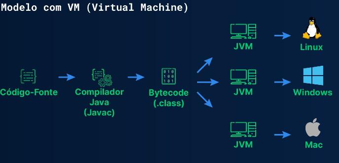

# **Introdução**

☕ Java é uma linguagem de programação de alto nível e orientada a objetos, amplamente utilizada para o desenvolvimento
de aplicações multiplataforma — desde sistemas desktop e web até aplicativos Android.

O código Java é compilado para um formato intermediário chamado bytecode, que não é executado diretamente pelo sistema
operacional.
Em vez disso, o bytecode é interpretado pela Java Virtual Machine (JVM), o que torna possível executar o mesmo programa
em diferentes sistemas operacionais, como Windows, Linux e macOS.

🔄 Processo de compilação:

1. O desenvolvedor escreve o código em um arquivo `.java`
2. O compilador (`javac`) converte o código em *bytecode*, gerando um arquivo `.class`
3. A **JVM** lê esse *bytecode* e o converte em **código nativo** usando o compilador JIT (*Just-In-Time*)

Representação simplificada:

.java → javac → .class (bytecode) → JVM (JIT) → Código nativo

💡 A principal vantagem do Java é o conceito de "escreva uma vez, execute em qualquer lugar", graças à JVM.