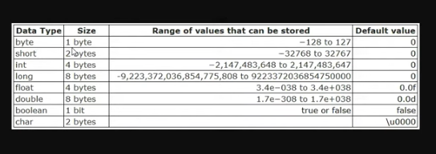
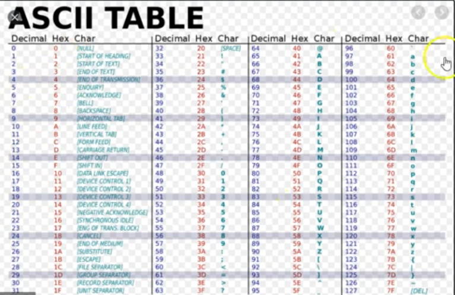
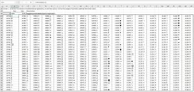

# **🎲 Tipos de Dados**

##### **Tipos primitivos**

Armazenam valores simples diretamente na memória:

- byte – números inteiros pequenos (-128 a 127)
- short – inteiros curtos (-32.768 a 32.767)
- int – inteiros comuns
- long – inteiros longos
- float – números decimais de precisão simples
- double – números decimais de dupla precisão
- char – caracteres únicos (como 'A')
- boolean – valores lógicos (true ou false)
- Referência: armazenam endereços de objetos (como String, arrays e classes personalizadas)

  

  

  

##### **🔠 String**

Representa uma sequência de caracteres (texto).

É tratada como um objeto, não um tipo primitivo.

Pertencente ao pacote java.lang.

Ela é caracterizada pela imutabilidade: não pode ser alterada após a criação.

É amplamente usada para manipulação de textos, permitindo criar instâncias
por literais ("texto") ou pelo construtor new String().

##### **Variáveis**

Uma variável é um espaço na memória para armazenar um valor.

A sintaxe básica é: tipo nomeDaVariavel = valor;

Exemplos:

- int idade = 25;
- double salario = 3500.50;
- boolean ativo = true;
- String nome = "João";