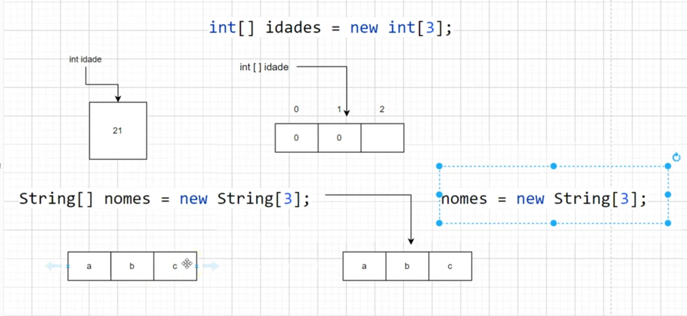
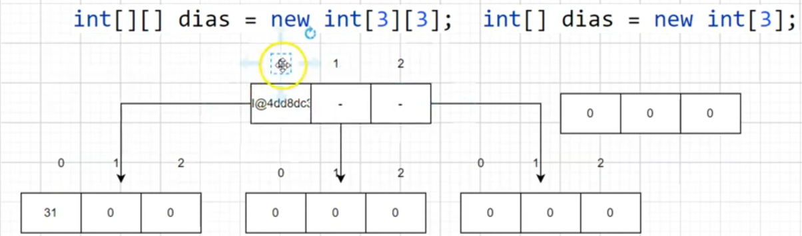

# 📚 Arrays

Arrays são estruturas de dados que permitem armazenar **vários valores do mesmo tipo** em uma única variável.

💡 Cada elemento é acessado por um **índice numérico**, que começa em `0`.

---

## 📊 Representação visual



---

## ⚙️ Declaração e inicialização

```
// Declara e inicializa um array de inteiros
int[] numeros = {10, 20, 30, 40};
```

---

## 🔁 Percorrendo um array

### 🔹 for-each (mais simples)

Percorre todos os elementos automaticamente:

```
for (int num : numeros) {
    System.out.println(num);
}
```

---

### 🔹 for tradicional

Utiliza índices para acessar cada posição:

```
for (int i = 0; i < numeros.length; i++) {
    System.out.println(numeros[i]);
}
```

---

## 🧠 Arrays Multidimensionais

Um array multidimensional é um array que contém **outros arrays**.

💡 O tipo mais comum é o **bidimensional (matriz)**, que pode ser visto como uma tabela (linhas e colunas).

---

## 📊 Representação de matriz



---

## ⚙️ Exemplo de matriz

```
// Declara e inicializa um array bidimensional
int[][] matriz = {
    {1, 2, 3},
    {4, 5, 6},
    {7, 8, 9}
};
```

---

## 🔁 Percorrendo matriz

### 🔹 for tradicional

```
for (int i = 0; i < matriz.length; i++) {
    for (int j = 0; j < matriz[i].length; j++) {
        System.out.print(matriz[i][j] + " ");
    }
    System.out.println();
}
```

---

### 🔹 for-each

```
for (int[] linha : matriz) {
    for (int elemento : linha) {
        System.out.print(elemento + " ");
    }
    System.out.println();
}
```

---

## 🚀 Resumo rápido

* 📚 Arrays armazenam múltiplos valores do mesmo tipo
* 🔢 Índices começam em `0`
* 🔁 Podem ser percorridos com `for` ou `for-each`
* 🧠 Matrizes são arrays de arrays
* 📊 Muito usados para dados estruturados