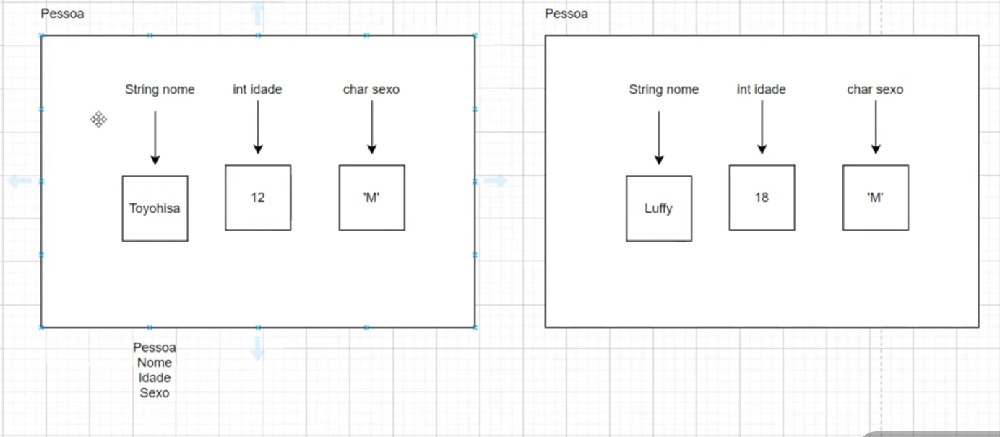

# 🧱 Orientação a Objetos (OO)

A **Orientação a Objetos (OO)** é um paradigma de programação que organiza o código em torno de **objetos**, representando entidades do mundo real.

💡 Cada objeto possui:

* 📦 **Atributos** → características
* ⚙️ **Métodos** → comportamentos

💡 Cada atributo de uma classe possui um **valor padrão de inicialização**, que depende do tipo.

---

## 🧠 Pilares da Orientação a Objetos

A OO é baseada em quatro pilares fundamentais:

* 🔒 **Encapsulamento**
* 🧬 **Herança**
* 🔁 **Polimorfismo**
* 🎯 **Abstração**

💡 Esses conceitos permitem criar sistemas **modulares**, **reutilizáveis** e **fáceis de manter**.

---

## 📊 Representação visual



---

## 🧱 Classes

Uma **classe** é um **modelo** que define como um objeto será.

Ela especifica:

* 📦 Atributos (dados)
* ⚙️ Métodos (ações)

---

### 💻 Exemplo de classe

```
public class Carro {

    // Atributos
    public String nome;
    public String modelo;
    public int ano;

    // Método
    public void exibir() {
        System.out.println(nome + " " + modelo + " - Ano: " + ano);
    }
}
```

---

## 📦 Objetos

Um **objeto** é uma instância de uma classe.

💡 Ou seja, é um “exemplo real” criado a partir do modelo.

---

### 💻 Exemplo de objetos

```
public class Principal {
    public static void main(String[] args) {

        // Criando objeto carro1
        Carro carro1 = new Carro();
        carro1.nome = "Hyundai";
        carro1.modelo = "HB20";
        carro1.ano = 2023;

        // Criando objeto carro2
        Carro carro2 = new Carro();
        carro2.nome = "Renault";
        carro2.modelo = "C3";
        carro2.ano = 2022;
    }
}
```

---

## 🧠 Variáveis de referência (muito importante)

Em Java, variáveis de referência **não armazenam o objeto em si**, mas sim o **endereço de memória onde o objeto está (heap)**.

---

### 📌 Exemplo

```
Carro c1 = new Carro();
Carro c2 = c1;
```

💡 Aqui:

* `c1` e `c2` apontam para o **mesmo objeto**
* Alterar um afeta o outro

---

### 💻 Demonstração

```
c1.nome = "HB20";
System.out.println(c2.nome); // HB20
```

✔ Ambas referências acessam o mesmo objeto

---

## ⚠️ Passagem por valor

Em Java, **tudo é passado por valor**, inclusive referências.

👉 Isso significa que o método recebe **uma cópia da referência**, não o objeto original diretamente.

---

### 📌 Exemplo

```
public static void alterar(Carro c) {
    c.nome = "Alterado";
}

public static void main(String[] args) {
    Carro carro = new Carro();
    alterar(carro);

    System.out.println(carro.nome); // Alterado
}
```

✔ O objeto foi alterado porque a referência aponta para ele

---

### ❗ Importante

```
public static void alterar(Carro c) {
    c = new Carro(); // NÃO altera o objeto original
}
```

💡 Aqui você está mudando **a cópia da referência**, não o objeto original.

---

## ⚠️ Valores padrão (importante)

Quando um atributo de classe não é inicializado, o Java define automaticamente um valor padrão:

* 🔢 Tipos numéricos (`int`, `double`, etc.) → `0`
* 🔘 `boolean` → `false`
* 🔠 `char` → `'\u0000'`
* 📦 Objetos → `null`

---

### 📌 Exemplo

```
public class Pessoa {
    int idade;       // 0
    boolean ativo;   // false
    String nome;     // null
}
```

---

### ❌ Atenção (pegadinha comum)

Variáveis locais **não recebem valor padrão**:

```
int idade;
System.out.println(idade); // ERRO!
```

---

## 🧠 Coesão e Acoplamento

### 🧩 Coesão

* Alta coesão → classe com responsabilidade única ✔
* Baixa coesão → classe faz muitas coisas ❌

---

### 🔗 Acoplamento

* Baixo acoplamento → classes independentes ✔
* Alto acoplamento → classes dependentes ❌

---

### 🎯 Regra de ouro

> ✅ Alta coesão + Baixo acoplamento = Código de qualidade

---

## 🧠 Classe vs Objeto

| 📌 Conceito   | 📝 Descrição                         |
| ------------- | ------------------------------------- |
| **Classe**    | Modelo que define atributos e métodos |
| **Objeto**    | Instância concreta da classe          |
| **Atributos** | Características                       |
| **Métodos**   | Ações                                 |

---

## 🚀 Resumo rápido

* 🧱 Classe → modelo
* 📦 Objeto → instância
* 🧠 Referência → aponta para o objeto
* 🔁 Pode haver várias referências para o mesmo objeto
* ⚠️ Java passa tudo por valor
* 🧩 Alta coesão = bom design
* 🔗 Baixo acoplamento = código flexível